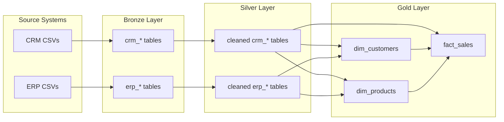

# SQL Data Warehouse Project

A hands-on data engineering project that builds a modern data warehouse on **Microsoft SQL Server** using the **Medallion Architecture** (Bronze → Silver → Gold). Source data from ERP and CRM systems is ingested from CSV files, cleansed and integrated through ETL pipelines, and modeled into a star schema for analytics and reporting.

Based on the [Data With Baraa SQL Data Warehouse course](https://github.com/DataWithBaraa/sql-data-warehouse-project).

---

## Architecture

The warehouse follows three layers:

| Layer | Purpose | Objects |
|-------|---------|---------|
| **Bronze** | Raw ingestion | Tables loaded as-is from CSV via `BULK INSERT` |
| **Silver** | Cleansing & standardization | Tables with trimmed values, normalized codes, and type conversions |
| **Gold** | Analytics-ready model | Star schema views: `dim_customers`, `dim_products`, `fact_sales` |



### Data Sources

**CRM** (`datasets/source_crm/`)

| File | Description |
|------|-------------|
| `cust_info.csv` | Customer demographics and identifiers |
| `prd_info.csv` | Product catalog and pricing |
| `sales_details.csv` | Sales order line items |

**ERP** (`datasets/source_erp/`)

| File | Description |
|------|-------------|
| `CUST_AZ12.csv` | Customer birthdate and gender |
| `LOC_A101.csv` | Customer country/location |
| `PX_CAT_G1V2.csv` | Product category and subcategory |

### Gold Layer (Star Schema)

| Object | Type | Description |
|--------|------|-------------|
| `gold.dim_customers` | Dimension | Customers enriched with ERP location and demographic data |
| `gold.dim_products` | Dimension | Active products with ERP category attributes |
| `gold.fact_sales` | Fact | Sales transactions linked to customer and product dimensions |

See [docs/data_catalog.md](sql-data-warehouse-project-main/sql-data-warehouse-project-main/docs/data_catalog.md) for column-level documentation.

---

## Prerequisites

- [SQL Server Express](https://www.microsoft.com/en-us/sql-server/sql-server-downloads) (or Developer Edition)
- [SQL Server Management Studio (SSMS)](https://learn.microsoft.com/en-us/sql/ssms/download-sql-server-management-studio-ssms)
- Windows environment (required for `BULK INSERT` from local file paths)

---

## Getting Started

### 1. Clone or download this repository

```text
DataWarehouse/
└── sql-data-warehouse-project-main/
    └── sql-data-warehouse-project-main/
        ├── datasets/
        ├── docs/
        ├── scripts/
        └── tests/
```

### 2. Place datasets where SQL Server can read them

The bronze load procedure expects CSV files at:

```text
C:\sql\dwh_project\datasets\
├── source_crm\
│   ├── cust_info.csv
│   ├── prd_info.csv
│   └── sales_details.csv
└── source_erp\
    ├── cust_az12.csv
    ├── loc_a101.csv
    └── px_cat_g1v2.csv
```

Copy the `datasets/` folder from this repo to that path, **or** update the file paths in `scripts/bronze/proc_load_bronze.sql` to match your local directory.

> **Note:** The SQL Server service account must have read access to the CSV folder.

### 3. Run scripts in order (SSMS)

Open and execute each script against your SQL Server instance:

| Step | Script | Action |
|------|--------|--------|
| 1 | `scripts/init_database.sql` | Creates `DataWarehouse` database and `bronze`, `silver`, `gold` schemas |
| 2 | `scripts/bronze/ddl_bronze.sql` | Creates bronze tables |
| 3 | `scripts/bronze/proc_load_bronze.sql` | Creates `bronze.load_bronze` procedure |
| 4 | `scripts/silver/ddl_silver.sql` | Creates silver tables |
| 5 | `scripts/silver/proc_load_silver.sql` | Creates `silver.load_silver` procedure |
| 6 | `scripts/gold/ddl_gold.sql` | Creates gold layer views |

All script paths are relative to:

`sql-data-warehouse-project-main/sql-data-warehouse-project-main/`

### 4. Load the data

```sql
USE DataWarehouse;
GO

EXEC bronze.load_bronze;
EXEC silver.load_silver;
```

Gold views are populated automatically when queried — no separate load procedure is required.

### 5. Query the gold layer

```sql
-- Sample analytics query
SELECT
    c.country,
    p.category,
    SUM(f.sales_amount) AS total_sales,
    SUM(f.quantity)     AS total_quantity
FROM gold.fact_sales f
JOIN gold.dim_customers c ON f.customer_key = c.customer_key
JOIN gold.dim_products  p ON f.product_key  = p.product_key
GROUP BY c.country, p.category
ORDER BY total_sales DESC;
```

### 6. Run quality checks

Validate data integrity after loading:

```sql
-- Run in SSMS
-- tests/quality_checks_silver.sql
-- tests/quality_checks_gold.sql
```

These scripts check surrogate key uniqueness and referential integrity between fact and dimension tables. Empty result sets indicate passing checks.

---

## Repository Structure

```text
sql-data-warehouse-project-main/sql-data-warehouse-project-main/
│
├── datasets/
│   ├── source_crm/          # CRM source CSV files
│   └── source_erp/          # ERP source CSV files
│
├── docs/
│   ├── data_catalog.md      # Gold layer column documentation
│   └── naming_conventions.md
│
├── scripts/
│   ├── init_database.sql    # Database and schema setup
│   ├── bronze/
│   │   ├── ddl_bronze.sql
│   │   └── proc_load_bronze.sql
│   ├── silver/
│   │   ├── ddl_silver.sql
│   │   └── proc_load_silver.sql
│   └── gold/
│       └── ddl_gold.sql
│
└── tests/
    ├── quality_checks_silver.sql
    └── quality_checks_gold.sql
```

---

## Key Transformations

**Silver layer** applies cleansing rules such as:

- Trimming whitespace on text fields
- Normalizing marital status (`S` → `Single`, `M` → `Married`)
- Normalizing gender codes (`F` → `Female`, `M` → `Male`)
- Converting ERP date integers to `DATE` values
- Deduplicating customer records (latest record per `cst_key`)

**Gold layer** integrates sources:

- Joins CRM customers with ERP location and demographic data
- Enriches products with ERP category/subcategory attributes
- Filters to current product records only (`prd_end_dt IS NULL`)
- Builds `fact_sales` with surrogate keys to dimension views

---

## Troubleshooting

| Issue | Solution |
|-------|----------|
| `BULK INSERT` permission denied | Grant the SQL Server service account read access to the CSV directory |
| File not found during bronze load | Verify paths in `proc_load_bronze.sql` match your local `datasets/` location |
| Empty gold views | Ensure bronze and silver loads completed without errors |
| Orphaned fact records | Check `quality_checks_gold.sql` for missing dimension keys |

---

## License

This project is licensed under the [MIT License](sql-data-warehouse-project-main/sql-data-warehouse-project-main/LICENSE).

## Credits

Original course materials and project template by **[Baraa Khatib Salkini](https://www.datawithbaraa.com)** ([Data With Baraa](https://github.com/DataWithBaraa/sql-data-warehouse-project)).
